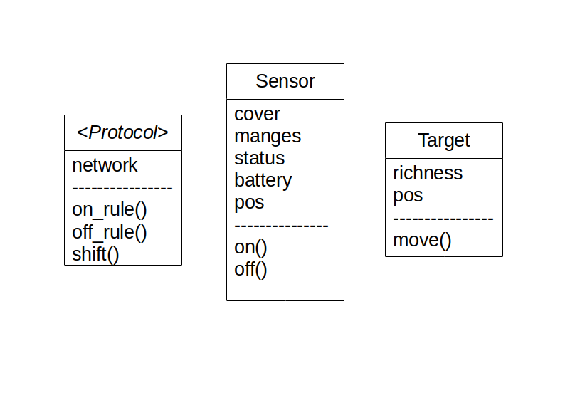

# Algorithm

The algorithm used to handle the problem is given bellow.

```
while available(sensors in network):
	shift()

shift():
	check_reach(sensors, targets)
	on_rule()
	off_rule()
	consume_battery(sensors)
	if sensor.battery <=0:
		remove(sensor from network)
```

We try to keep the sensor network up iteratively in each shift execution until all the sensors have consumed their battery. As per any protocol, if the targets are moving, the `check_reach()` of a sensor should be checked. This is to ensure that the cover of the sensor was updated in each time step to handle the target movements. Battery consumption in each shift iteration should always make sure that the otherwise while loop will terminate when there are no sensors with positive battery.

# Implementation

The implementation of the Sensor Simulation is called _SenSim_. This implements the algorithms discussed in the following chapters. Creating a simulation framework for sensors was necessary because the challenges we provided for the protocols were not possible to implement using NS2 or TCL adapters for NS2. We have used Python3 a general purpose hybrid programming language for implementing this simulation, ability to rapidly develop using python was helpful because the time was limited.

Sensors, Targets and Protocols were treated as `Objects` in object oriented programming to help maintain and extend the functionalities of the API. An abstract class of `Protocol` was created to standardise the implementation of any protocol object. 



Implementation of [_SenSim_](https://github.com/bhashithe/sensim) is available at github.

## Sensors

Sensors have ability to turn on and off themselves while covering a set of targets. Also they have a battery which depletes while being turned on. Battery consumption will always happen with one unit. In some protocols, there are 3 statuses for sensors `on`, `off` and `alert`. However, alert status works similar to the on status in  most cases, therefore when implementing the API, it was considered as to sensors having only two statuses `on` and `off`. Depending on the protocol, sensors are assign as `in-charge` of some targets. This functionality is also kept open to the protocols which are using it.

## Targets

Targets have minimal capabilities in almost all the sensor network protocols. Therefore only a position of a target and summation of all the sensor batteries which are covering the target is kept as attributes of the target object. However, in one of the challenges presented to the network protocols, we make the targets to move around randomly. Moving the target is not something related to the protocol therefore, capability to randomly moving around in the environment is given to the targets.

## Protocols

Functions `on_rule()`, `off_rule()` and `shift()` were introduced into this abstract class as abstract functions. This made sure that each protocol implemented using the API would have all these functions implemented. Depending on protocol all these functions should be implemented differently. But for some protocols there are similarities in some functions. For example, take the `on_rule()` of the `LBP` protocol and `DEEPS` protocol. They are technically the same rule. Therefore, you could extend functionality for the protocols using other protocols, it is convenient to implement the protocols using this API. 

Using these classes, we have implemented 4 protocols to simulate and compare with each other.
- Load Balancing Protocol
- DEEPS: Deterministic Energy-Efficient Protocol for Sensor network
- Moving target variation of both LBP and DEEPS

## Simulation

Simulation class was implemented to handle simulations for protocols. The two functionalities given for this class are `simulate()` and `compare()`. It was needed to generate sensors and targets at random points to randomly generate a sensor network. This object comes with the functionality to generate networks as well. A mathematical library `numpy` was used to generate random numbers. Since an environment was set beforehand we needed to uniformly generate random numbers in the whole environment. Numpy provides a function to generate uniform random number pairs which helped to handle this scenario.

Using this API it is possible to simulate a protocol in a given or randomly generated network of targets and sensors. And also, the functionality is given to compare two protocols and how they hold up in a given sensor network. Simulations would generate graphs and return current details about the network, such as how many targets are covered and how long the sensor network is up. Instead of stopping at the first full target cover, we keep the simulation going until there are no sensors available to cover the targets. This has been done considering that one of the challenges we presented for the protocols. Since the targets can move around in the environment, it is possible for a *non-moving target protocol* to 'loose' a covered target during one time step and in another it can cover the same target. The comparisons, usually return more information about the status of the sensor network. For a comparison, apart from the same outputs of a simulation, we get to see how many sensors are alive at a given time step from both protocols.
